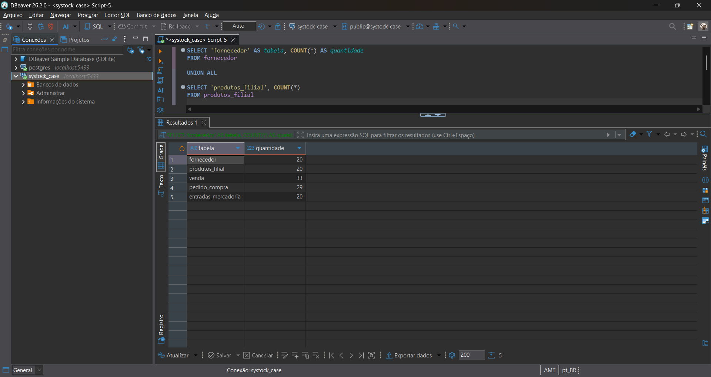
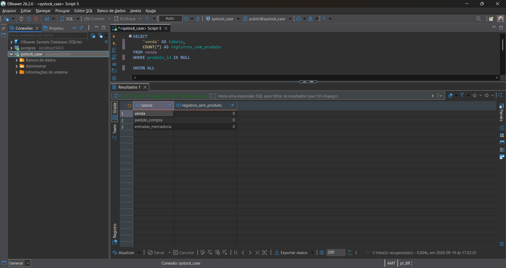
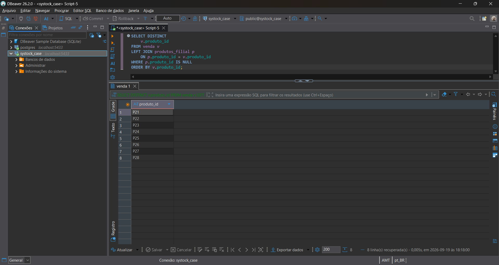
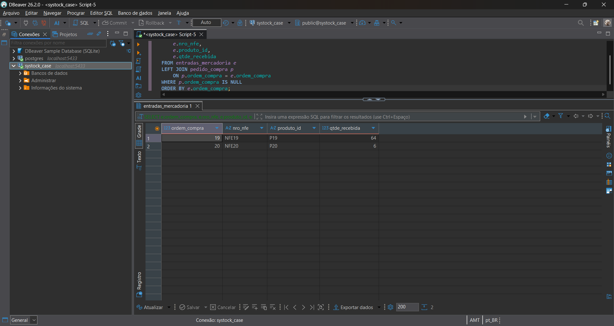
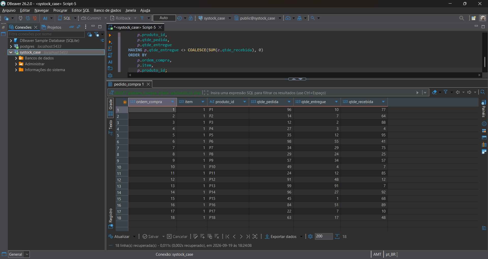
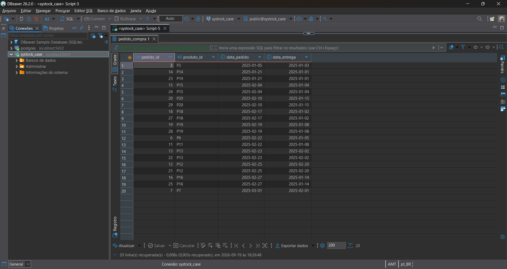
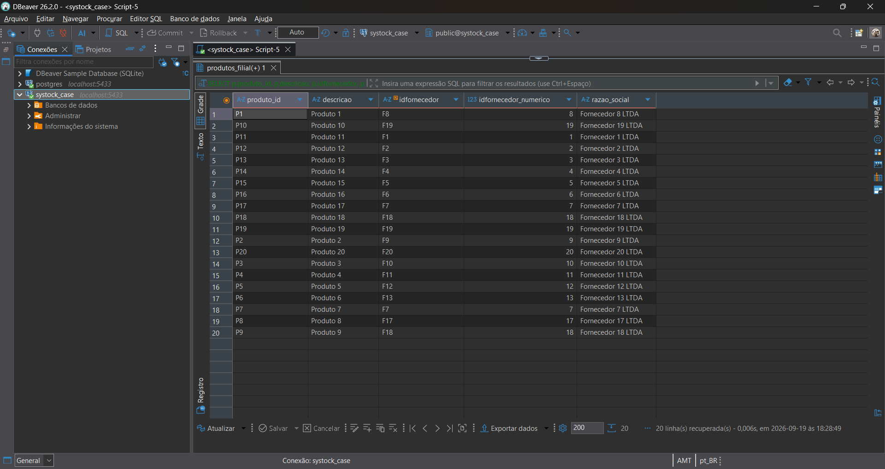
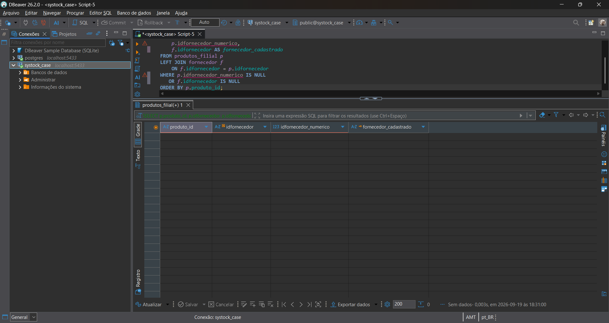
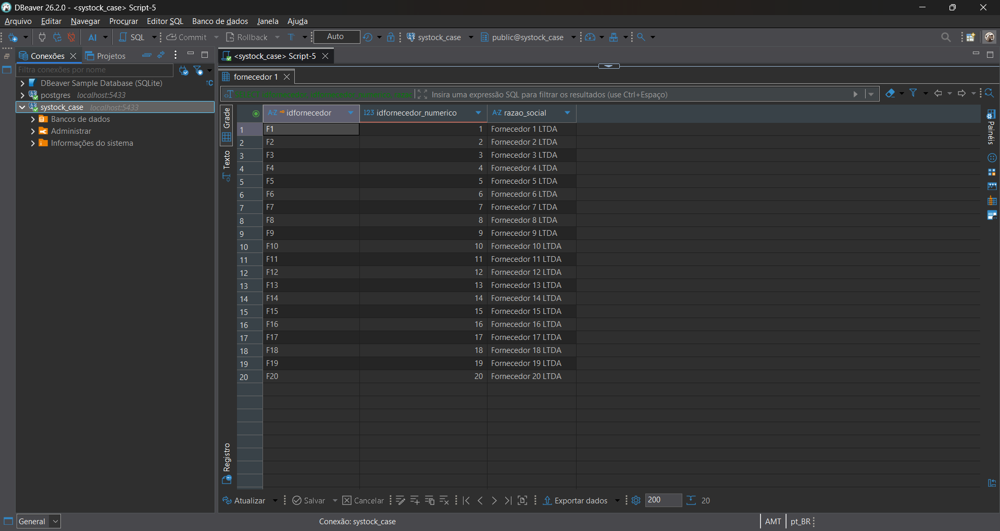
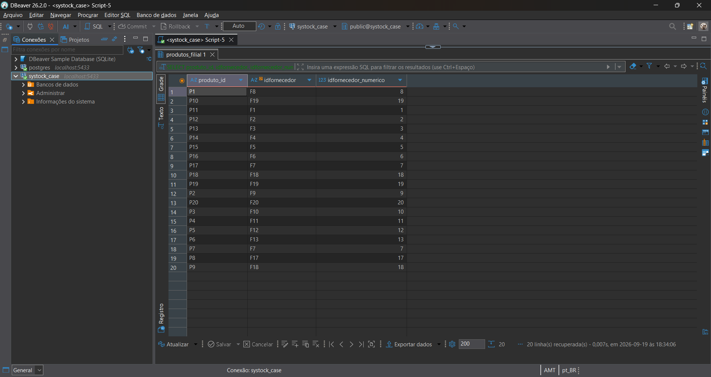

# Case Técnico — Analista de Integração de Dados (Implantação)

Projeto desenvolvido como solução para o case técnico de **Analista de Integração de Dados (Implantação)** da Systock.

O objetivo é demonstrar o processo de análise, importação, tratamento, validação e consulta de dados utilizando **PostgreSQL e SQL**, com foco em qualidade de dados, integridade, rastreabilidade e validação dos resultados.

---

## Sobre o projeto

O projeto utiliza uma base de dados fornecida em formato Excel contendo informações relacionadas a:

- vendas;

- pedidos de compra;

- entradas de mercadoria;

- produtos por filial;

- fornecedores.

A solução foi estruturada para reproduzir um cenário de integração de dados, considerando tanto a estrutura esperada quanto as inconsistências identificadas na fonte recebida.

A base original é preservada sem alterações, enquanto os tratamentos, consultas, validações e evidências são organizados separadamente no projeto.

---

## Objetivos

- Analisar a estrutura e a qualidade dos dados recebidos;

- Identificar inconsistências e problemas de integridade;

- Modelar os dados em um banco PostgreSQL;

- Importar os dados para o banco;

- Aplicar tratamentos e validações utilizando SQL;

- Desenvolver as consultas solicitadas no case;

- Implementar as transformações e automações necessárias;

- Documentar as decisões tomadas durante o processo;

- Validar os resultados obtidos;

- Manter evidências das principais etapas;

- Gerar um backup do banco ao final do processo.

---

## Tecnologias

- DBeaver

- PostgreSQL 18

- SQL

- Git

- GitHub

- Microsoft Excel

---

## Estrutura do projeto

```text

case-tecnico-integracao-dados-systock/

│

├── README.md

├── .gitignore

│

├── docs/

│   ├── 01-entendimento-do-case.md

│   ├── 02-processo-de-importacao.md

│   ├── 03-erros-e-inconsistencias.md

│   ├── 04-regras-de-negocio.md

│   ├── 05-estrategia-de-validacao.md

│   └── 06-resultados.md

│

├── database/

│   ├── 01-create-tables.sql

│   ├── 02-import-data.sql

│   ├── 03-fixes-and-validations.sql

│   ├── 04-basic-queries.sql

│   ├── 05-transformations.sql

│   ├── 06-trigger.sql

│   └── 07-client-validation.sql

│

├── data/

│   ├── original/

│   │   └── base_teste_systock.xlsx

│   │

│   └── processed/

│       ├── fornecedor.csv

│       ├── produtos_filial.csv

│       ├── venda.csv

│       ├── pedido_compra.csv

│       └── entradas_mercadoria.csv

│

├── backup/

│   └── systock_case_backup.dump

│

└── evidence/

    ├── 01-Auditoria-volumes.png

    ├── 02-Auditoria-nulos.png

    ├── 03-Auditoria-valores-negativos.png

    ├── 04-INCO01-produtos-sem-cadastro.png

    ├── 05-INCO02-filiais-sem-cadastro.png

    ├── 06-INCO03-ordem-compra-zero.png

    ├── 07-INCO04-entradas-sem-pedido.png

    ├── 08-INCO05-inconsistencia-temporal.png

    ├── 09-INCO06-divergencia-pedido-recebimento.png

    ├── 10-2.1-consumo-fevereiro.png

    ├── 11-2.2-produtos-nao-recebidos.png

    ├── 12-3.1-concatenacao-produto.png

    ├── 13-3.2-formatacao-datas.png

    ├── 14-3.3-produtos-mais-10-requisicoes.png

    ├── 15-3.4-teste-trigger.png

    ├── 16-3.4-rollback-teste-trigger.png

    ├── 17-4.1-validacao-quantidade-registros.png

    ├── 18-4.2-validacao-valores-nulos.png

    ├── 19-4.3-validacao-valores-negativos.png

    ├── 20-4.4-produtos-vendidos-sem-cadastro.png

    ├── 21-4.5-entradas-sem-pedido.png

    ├── 22-4.6-divergencia-pedido-recebimento.png

    ├── 23-4.7-inconsistencia-temporal.png

    ├── 24-4.8-relacionamento-produto-fornecedor.png

    ├── 25-4.9-integridade-idfornecedor-numerico.png

    ├── 26-4.10-identificadores-fornecedor.png

    └── 27-4.11-validacao-identificadores-produtos.png

```

---

## Processo da solução

O desenvolvimento segue um fluxo de implantação dividido em etapas:

```text

Base recebida

      ↓

Análise da estrutura

      ↓

Análise da qualidade dos dados

      ↓

Identificação das inconsistências

      ↓

Definição das regras de tratamento

      ↓

Modelagem PostgreSQL

      ↓

Importação dos dados

      ↓

Validações e identificação de inconsistências

      ↓

Consultas SQL

      ↓

Transformações

      ↓

Automação com Trigger

      ↓

Validação dos resultados

      ↓

Backup

```

---

## Análise da qualidade dos dados

Durante a análise da base foram realizadas verificações relacionadas a:

- quantidade de registros;

- valores nulos;

- valores negativos;

- registros duplicados;

- produtos sem cadastro correspondente;

- cobertura de produtos por filial;

- ordens de compra sem identificação;

- entradas de mercadoria sem pedido correspondente;

- inconsistências entre datas;

- divergências entre quantidades solicitadas e recebidas;

- identificação e relacionamento de fornecedores.

As inconsistências encontradas foram documentadas antes da aplicação de qualquer tratamento.

---

## Principais inconsistências identificadas

Entre as inconsistências encontradas na base estão:

- produtos presentes nas vendas sem cadastro correspondente em `produtos_filial`;

- vendas associadas a filiais sem cobertura correspondente no cadastro de produtos;

- pedidos de compra com `ordem_compra = 0`;

- entradas de mercadoria sem pedido de compra correspondente;

- datas de entrega anteriores às respectivas datas do pedido;

- divergências entre quantidades registradas no pedido e quantidades recebidas;

- diferenças entre a identificação do fornecedor na fonte e a estrutura utilizada no banco.

As evidências dessas ocorrências estão armazenadas na pasta `evidence/`.

A documentação detalhada está disponível em:

`docs/03-erros-e-inconsistencias.md`

---

## Regras de negócio

As principais regras utilizadas durante a implementação incluem:

- identificação de produtos por `produto_id`;

- relacionamento entre produto e filial;

- cálculo do consumo por produto;

- análise do período de fevereiro de 2025;

- identificação de produtos solicitados e não recebidos;

- concatenação de código e descrição do produto;

- apresentação de datas no formato `DD/MM/YYYY`;

- identificação de produtos requisitados mais de 10 vezes;

- relacionamento entre produtos e fornecedores;

- geração automática de identificador numérico para fornecedores;

- relacionamento do identificador numérico do fornecedor com os produtos;

- validação das quantidades solicitadas e recebidas;

- preservação dos dados originais quando não existe regra suficiente para determinar uma correção.

As regras estão documentadas em:

`docs/04-regras-de-negocio.md`

---

# Consultas e resultados

As consultas SQL foram organizadas em arquivos específicos para facilitar a reprodução do processo.

## Consumo por produto em fevereiro de 2025

Foi realizada a consolidação da quantidade consumida e do valor total por produto para o período solicitado no case.

A consulta utilizada está em:

`database/04-basic-queries.sql`

O resultado contempla:

- `produto_id`;

- quantidade consumida;

- valor total consumido.

---

## Produtos solicitados, mas não recebidos

Foi realizada a identificação dos pedidos que foram requisitados, mas não apresentaram quantidade recebida nas entradas de mercadoria.

O relacionamento entre pedidos e entradas considera o campo `ordem_compra`, conforme orientação do case.

A consulta utilizada está em:

`database/04-basic-queries.sql`

---

# Transformações

Foram implementadas transformações SQL para atender aos requisitos da Parte 3.

## 1. Concatenação de produto

Foi criada uma consulta para concatenar:

```text

produto_id + descrição

```

no formato:

```text

P14 - Descrição do produto

```

Consulta:

`database/05-transformations.sql`

Evidência:

`evidence/12-3.1-concatenacao-produto.png`

---

## 2. Formatação das datas

As datas foram transformadas para o formato solicitado:

```text

DD/MM/YYYY

```

Utilizando a função:

```sql

TO_CHAR(data_pedido, 'DD/MM/YYYY')

```

Consulta:

`database/05-transformations.sql`

Evidência:

`evidence/13-3.2-formatacao-datas.png`

---

## 3. Produtos requisitados mais de 10 vezes

Foi criada uma consulta utilizando `GROUP BY`, `COUNT()` e `HAVING` para identificar produtos requisitados mais de 10 vezes no período analisado.

Consulta:

`database/05-transformations.sql`

O resultado da análise não apresentou produtos que ultrapassassem o limite de 10 requisições.

Evidência:

`evidence/14-3.3-produtos-mais-10-requisicoes.png`

---

# Trigger e geração do identificador numérico do fornecedor

Para atender ao requisito de geração automática de um novo identificador numérico para fornecedores, foi implementada uma solução utilizando:

- `SEQUENCE`;

- função `PL/pgSQL`;

- trigger `BEFORE INSERT`;

- relacionamento entre fornecedor e produto;

- validações de integridade.

A sequência utilizada é:

```text

seq_idfornecedor_numerico

```

A função responsável pela geração é:

```text

fn_gerar_idfornecedor_numerico()

```

E a trigger é:

```text

trg_gerar_idfornecedor_numerico

```

O script completo está disponível em:

`database/06-trigger.sql`

---

## Funcionamento da trigger

O fluxo implementado é:

```text

Novo fornecedor

      ↓

INSERT na tabela fornecedor

      ↓

Trigger BEFORE INSERT

      ↓

Verificação do identificador numérico

      ↓

Próximo valor da SEQUENCE

      ↓

idfornecedor_numerico

      ↓

Relacionamento com produtos

```

A sequência foi inicialmente sincronizada com os identificadores existentes na base.

Os fornecedores existentes foram relacionados da seguinte forma:

```text

F1  → 1

F2  → 2

F3  → 3

...

F20 → 20

```

Após a sincronização, o próximo fornecedor cadastrado recebe automaticamente o próximo identificador disponível.

---

## Integridade do relacionamento

A tabela `fornecedor` possui o campo:

```text

idfornecedor_numerico

```

do tipo `BIGINT`.

O campo é utilizado como identificador numérico para o relacionamento com os produtos.

Foi criada uma restrição `UNIQUE` para impedir identificadores numéricos duplicados.

Também foi criada uma chave estrangeira na tabela `produtos_filial`, garantindo que o identificador numérico utilizado pelo produto exista no cadastro de fornecedores.

---

## Teste da trigger

Foi realizado um teste controlado para verificar o funcionamento da geração automática.

O fornecedor de teste utilizado foi:

```text

F21

```

Durante o teste, a trigger gerou:

```text

F21 → 21

```

Também foi realizado um teste de relacionamento com um produto fictício.

O produto de teste foi:

```text

TESTE_F21

```

e recebeu o identificador numérico correspondente ao fornecedor.

O teste foi executado dentro de uma transação e finalizado com:

```sql

ROLLBACK;

```

Dessa forma, os registros utilizados exclusivamente para teste não permaneceram na base definitiva.

Evidências:

- `evidence/15-3.4-teste-trigger.png`

- `evidence/16-3.4-rollback-teste-trigger.png`

---

## Sincronização da sequência

Após os testes, a sequência foi sincronizada novamente com o maior identificador existente na base.

O maior identificador existente é:

```text

20

```

A sequência foi ajustada para que o próximo valor disponível seja:

```text

21

```

Isso evita conflitos entre identificadores já existentes e novos fornecedores cadastrados.

---

# Validação da implantação

A validação final é realizada por meio de consultas SQL no PostgreSQL, permitindo verificar a integridade dos dados importados, os relacionamentos entre as tabelas, as inconsistências identificadas e as transformações aplicadas durante o processo.

## Validação da quantidade de registros

A primeira etapa da validação consistiu em comparar a quantidade de registros carregados no banco com a quantidade esperada para cada tabela.

| Tabela              | Registros |

| ------------------- | --------: |

| fornecedor          |        20 |

| produtos_filial     |        20 |

| venda               |        33 |

| pedido_compra       |        29 |

| entradas_mercadoria |        20 |

Os resultados obtidos correspondem às quantidades esperadas para as tabelas analisadas.

**Evidência:**



---

## Validação de valores nulos

Foi realizada uma verificação das tabelas `venda`, `pedido_compra` e `entradas_mercadoria` para identificar registros sem `produto_id`.

A consulta não identificou registros com valor nulo no campo analisado.

| Tabela              | Registros sem produto |

| ------------------- | --------------------: |

| venda               |                     0 |

| pedido_compra       |                     0 |

| entradas_mercadoria |                     0 |

**Evidência:**



---

## Validação de valores negativos

Foi realizada uma verificação das tabelas `venda`, `pedido_compra`, `entradas_mercadoria` e `produtos_filial` para identificar quantidades, preços e valores financeiros negativos.

A consulta não identificou registros com valores negativos nos campos analisados.

| Tabela              | Registros com valor negativo |

| ------------------- | ---------------------------: |

| venda               |                            0 |

| pedido_compra       |                            0 |

| entradas_mercadoria |                            0 |

| produtos_filial     |                            0 |

**Evidência:**


---

## Validação de produtos vendidos sem cadastro

Foi realizada uma validação para identificar produtos presentes na tabela `venda` que não possuem cadastro correspondente na tabela `produtos_filial`.

Foram identificados 8 produtos sem cadastro correspondente:

| Produto |

| ------- |

| P21     |

| P22     |

| P23     |

| P24     |

| P25     |

| P26     |

| P27     |

| P28     |

Essa ocorrência já havia sido identificada durante a análise inicial da qualidade dos dados e foi mantida como inconsistência documentada, sem criação de cadastros fictícios.

**Evidência:**



---

## Validação de entradas de mercadoria sem pedido de compra

Foi realizada uma validação para identificar entradas de mercadoria que não possuem um pedido de compra correspondente.

Foram identificadas duas ocorrências:

| Ordem de compra | NF-e  | Produto | Quantidade recebida |

| --------------: | ----- | ------- | ------------------: |

|              19 | NFE19 | P19     |                  64 |

|              20 | NFE20 | P20     |                   6 |

Essas ocorrências foram identificadas durante a análise inicial da qualidade dos dados e permanecem documentadas como inconsistências da fonte.

**Evidência:**



---

## Validação de divergência entre pedido e recebimento

Foi realizada uma comparação entre as quantidades registradas nos pedidos de compra e as quantidades encontradas nas entradas de mercadoria.

A validação identificou 18 registros com divergência entre `qtde_entregue` registrada no pedido e a soma de `qtde_recebida` nas entradas de mercadoria.

A consulta também permite comparar a quantidade originalmente solicitada (`qtde_pedida`) com os valores registrados durante o processo de recebimento.

As divergências foram mantidas como evidências da qualidade da fonte e não foram corrigidas sem uma regra de negócio ou validação do responsável pelo processo.

**Evidência:**



---

## Validação de inconsistências temporais

Foi realizada uma validação para identificar pedidos em que a `data_entrega` é anterior à `data_pedido`.

Foram identificados 20 registros com essa inconsistência temporal.

A ocorrência foi mantida como evidência da qualidade da fonte, sem alteração das datas originais, uma vez que não existe informação suficiente para determinar qual seria a data correta.

**Evidência:**



---

## Validação do relacionamento entre produto e fornecedor

Foi realizada uma validação do relacionamento entre os produtos cadastrados e seus respectivos fornecedores.

A consulta apresentou os 20 produtos cadastrados, permitindo verificar:

- `produto_id`;

- `idfornecedor`;

- `idfornecedor_numerico`;

- razão social do fornecedor.

A validação demonstrou a correspondência entre os registros de produtos e fornecedores cadastrados.

**Evidência:**



---

## Validação da integridade do identificador numérico do fornecedor

Foi realizada uma validação para identificar produtos sem `idfornecedor_numerico` ou com fornecedor não localizado no cadastro.

A consulta não retornou registros, indicando que todos os produtos analisados possuem um identificador numérico de fornecedor válido e relacionado ao cadastro correspondente.

**Resultado:** 0 inconsistências encontradas.

**Evidência:**



---

## Validação dos identificadores de fornecedor

Foi realizada uma validação do cadastro de fornecedores para verificar a correspondência entre o identificador original (`idfornecedor`) e o identificador numérico (`idfornecedor_numerico`).

Os 20 fornecedores apresentaram correspondência entre os identificadores e suas respectivas razões sociais.

| Identificador | ID numérico | Razão social       |

| ------------- | ----------: | ------------------ |

| F1            |           1 | Fornecedor 1 LTDA  |

| F2            |           2 | Fornecedor 2 LTDA  |

| F3            |           3 | Fornecedor 3 LTDA  |

| ...           |         ... | ...                |

| F20           |          20 | Fornecedor 20 LTDA |

**Evidência:**



---

## Validação dos identificadores dos produtos

Foi realizada uma validação final da tabela `produtos_filial` para verificar o preenchimento dos identificadores de fornecedor.

Os 20 produtos analisados apresentam `idfornecedor` e `idfornecedor_numerico` preenchidos, mantendo a correspondência entre o identificador original e o identificador numérico.

**Evidência:**



---

# Estratégia de validação com o cliente

A validação com o cliente foi estruturada considerando o mês de fevereiro de 2025 e os principais pontos que impactam a confiabilidade dos dados.

Os principais pontos a serem apresentados são:

- quantidade de registros importados;

- consistência dos produtos;

- consumo por produto;

- pedidos de compra;

- entradas de mercadoria;

- produtos requisitados e não recebidos;

- divergências de quantidades;

- consistência das datas;

- relacionamento entre produtos e fornecedores;

- identificação das inconsistências encontradas na fonte.

A estratégia completa está documentada em:

`docs/05-estrategia-de-validacao.md`

As consultas de apoio à reunião estão disponíveis em:

`database/07-client-validation.sql`

---

# Evidências

As evidências das principais etapas do projeto estão armazenadas na pasta:

```text

evidence/

```

As evidências incluem:

- auditoria inicial da base;

- identificação de inconsistências;

- resultados das consultas SQL;

- transformações realizadas;

- testes da trigger;

- rollback dos testes;

- validações da implantação;

- validação do relacionamento entre produtos e fornecedores.

A numeração das evidências segue a ordem das etapas executadas durante o desenvolvimento.

---

# Documentação

A documentação do projeto está organizada em etapas:

| Documento                       | Conteúdo                                              |

| ------------------------------- | ----------------------------------------------------- |

| `01-entendimento-do-case.md`    | Entendimento inicial, fonte e estrutura dos dados     |

| `02-processo-de-importacao.md`  | Estratégia e processo de importação                   |

| `03-erros-e-inconsistencias.md` | Problemas e inconsistências identificados na base     |

| `04-regras-de-negocio.md`       | Regras utilizadas para tratamento e validação         |

| `05-estrategia-de-validacao.md` | Estratégia de validação com o cliente                 |

| `06-resultados.md`              | Resultados das consultas, transformações e validações |

---

# Banco de dados

Os scripts SQL estão organizados conforme a sequência lógica de execução:

1\. `01-create-tables.sql` — criação das tabelas;

2\. `02-import-data.sql` — processo de importação;

3\. `03-fixes-and-validations.sql` — validações e identificação de inconsistências;

4\. `04-basic-queries.sql` — consultas solicitadas no case;

5\. `05-transformations.sql` — transformações dos dados;

6\. `06-trigger.sql` — geração e relacionamento do identificador numérico do fornecedor;

7\. `07-client-validation.sql` — consultas de validação final.

---

# Processo de importação

A planilha original foi analisada e seus dados foram separados em arquivos CSV correspondentes às tabelas do banco.

A estrutura processada foi:

```text

fornecedor.csv

produtos_filial.csv

venda.csv

pedido_compra.csv

entradas_mercadoria.csv

```

A importação foi realizada utilizando o **DBeaver**, conectado ao PostgreSQL.

Durante o processo foram considerados:

- conversão de datas;

- conversão de tipos numéricos;

- tratamento dos nomes das colunas;

- adequação da estrutura dos dados ao modelo PostgreSQL;

- validação dos registros após a importação;

- preservação dos dados originais;

- identificação das inconsistências existentes na fonte.

A documentação detalhada está disponível em:

`docs/02-processo-de-importacao.md`

---

# Qualidade e rastreabilidade

A base original é preservada sem alterações.

As inconsistências encontradas são documentadas antes da aplicação de qualquer tratamento.

Quando não existe informação suficiente para determinar o valor correto de um dado, o valor original é preservado e a ocorrência é sinalizada para validação.

A rastreabilidade do projeto é mantida por meio da relação entre:

```text

Dado recebido

      ↓

Análise

      ↓

Regra de tratamento

      ↓

Implementação SQL

      ↓

Validação

      ↓

Evidência

      ↓

Resultado

```

Essa abordagem permite acompanhar as decisões tomadas durante a implantação e reproduzir as etapas executadas.

---

# Backup do banco

O case solicita a disponibilização do backup do banco analisado.

Foi gerado um backup completo da base PostgreSQL utilizando `pg_dump` no formato custom.

Arquivo disponibilizado no projeto:

```text

backup/systock_case_backup.dump

```

Comando utilizado:

```bash

pg_dump -h localhost -p 5433 -U postgres -d systock_case -F c -f backup/systock_case_backup.dump

```

## Restauração do backup

Para restaurar o backup em uma base PostgreSQL:

```bash

pg_restore -h localhost -p 5433 -U postgres -d systock_case backup/systock_case_backup.dump

```

O backup contém a estrutura e os dados utilizados durante a análise, incluindo as alterações necessárias para a implementação e validação da solução.

---

# Como reproduzir o projeto

## 1. Criar o banco

Criar uma base PostgreSQL chamada:

```text

systock_case

```

## 2. Executar a criação das tabelas

Executar:

```text

database/01-create-tables.sql

```

## 3. Importar os dados

Realizar a importação dos arquivos CSV presentes em:

```text

data/processed/

```

A ordem recomendada é:

```text

fornecedor.csv

produtos_filial.csv

venda.csv

pedido_compra.csv

entradas_mercadoria.csv

```

As orientações estão documentadas em:

```text

database/02-import-data.sql

```

## 4. Executar as validações iniciais

Executar:

```text

database/03-fixes-and-validations.sql

```

## 5. Executar as consultas do case

Executar:

```text

database/04-basic-queries.sql

```

## 6. Executar as transformações

Executar:

```text

database/05-transformations.sql

```

## 7. Configurar a trigger

Executar:

```text

database/06-trigger.sql

```

## 8. Executar as validações finais

Executar:

```text

database/07-client-validation.sql

```

---

# Considerações finais

O projeto foi desenvolvido buscando reproduzir um cenário real de implantação e integração de dados.

Além da execução das consultas solicitadas, foram priorizados:

- análise da qualidade da fonte;

- identificação de inconsistências;

- integridade referencial;

- rastreabilidade;

- documentação das decisões;

- validação dos resultados;

- testes controlados;

- preservação dos dados originais;

- backup da base;

- organização das evidências.

As inconsistências identificadas não foram corrigidas de forma arbitrária. Quando não havia informação suficiente para determinar o valor correto, a ocorrência foi mantida e documentada para validação com o responsável pelo processo.

Essa abordagem permite diferenciar claramente:

```text

Dado original

      ↓

Inconsistência identificada

      ↓

Regra aplicada

      ↓

Resultado validado

```

---

# Status do projeto

## ✅ Projeto concluído tecnicamente

Etapas realizadas:

- [x] Análise da estrutura da base;
- [x] Análise da qualidade dos dados;
- [x] Identificação das inconsistências;
- [x] Modelagem do banco PostgreSQL;
- [x] Importação dos dados;
- [x] Consultas solicitadas no case;
- [x] Transformações;
- [x] Implementação da geração automática do identificador numérico do fornecedor;
- [x] Relacionamento entre fornecedor e produtos;
- [x] Teste da trigger;
- [x] Rollback dos dados de teste;
- [x] Sincronização da sequência;
- [x] Documentação das regras de negócio;
- [x] Documentação da estratégia de validação;
- [x] Validações finais da base;
- [x] Geração das evidências;
- [x] Geração do backup PostgreSQL;
- [x] Versionamento com Git;
- [x] Publicação do projeto no GitHub.

O projeto está preparado para entrega e avaliação.
