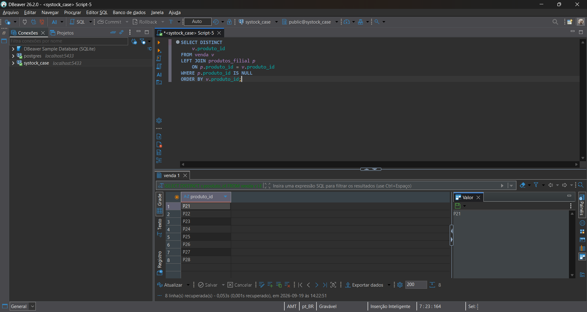
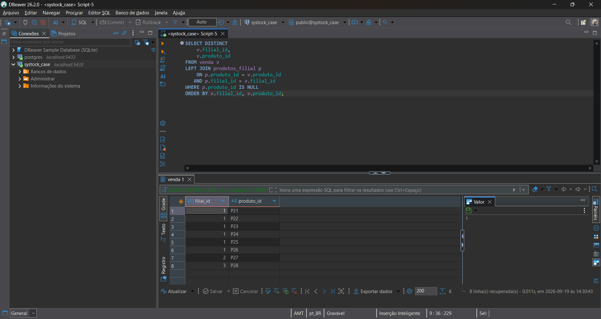
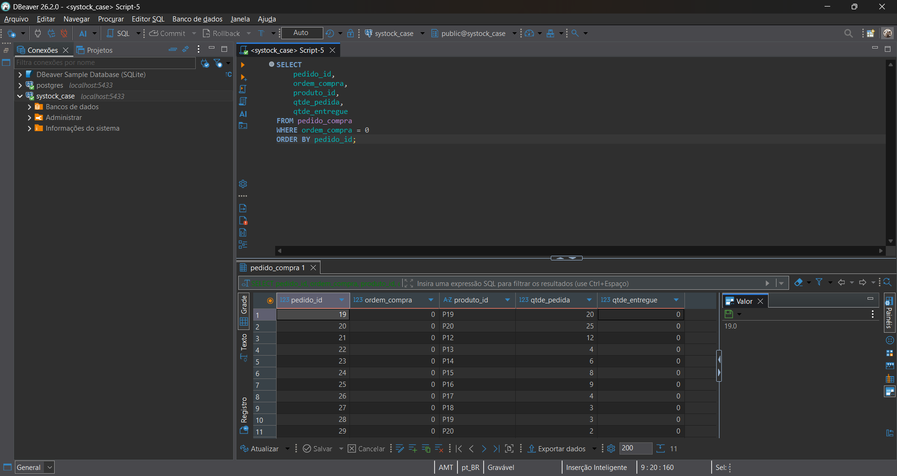
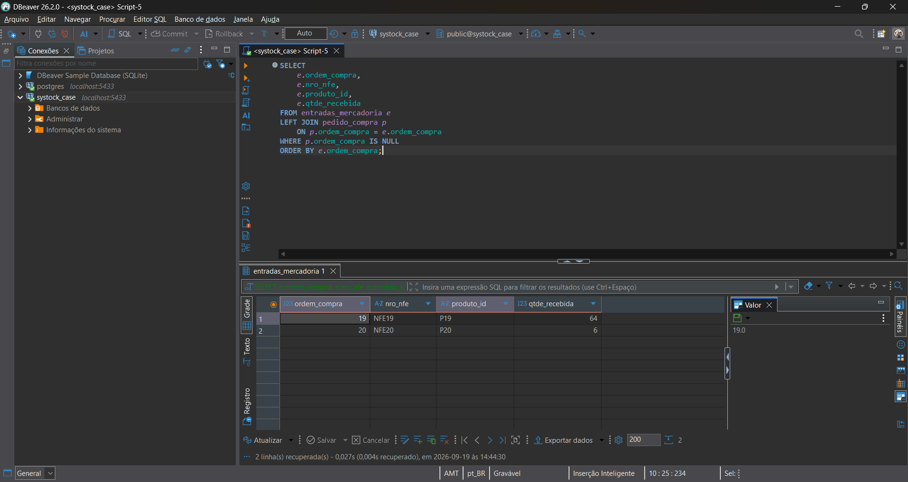
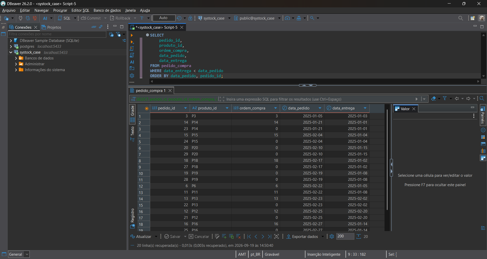
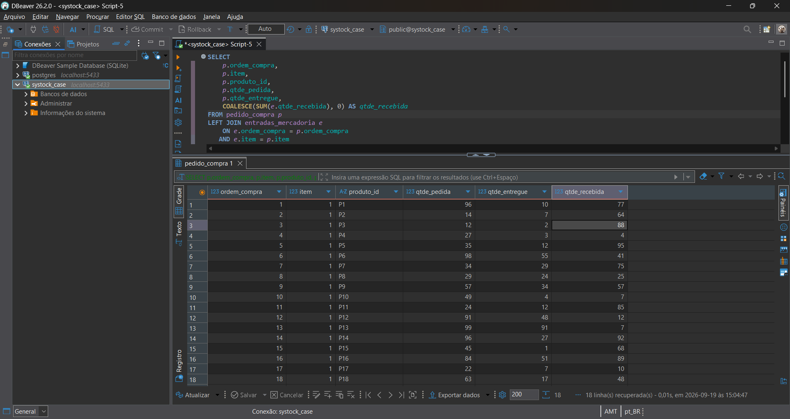

# 3. Erros e Inconsistências Identificados

## 3.1 Objetivo

Esta etapa tem como objetivo identificar problemas de qualidade,
integridade e consistência presentes na base de dados antes da
aplicação de qualquer tratamento.

A análise foi realizada sobre as cinco entidades disponibilizadas
no arquivo `base_teste_systock.xlsx`:

- `venda`
- `pedido_compra`
- `entradas_mercadoria`
- `produtos_filial`
- `fornecedor`

Nesta etapa, os dados originais não são alterados. Os problemas
são apenas identificados, classificados e documentados.

---

## 3.2 Resultado da análise de qualidade

### Volume de registros

Após a importação da base para o PostgreSQL, foi realizada uma
validação da quantidade de registros em cada tabela.

| Tabela | Registros |
|---|---:|
| `fornecedor` | 20 |
| `produtos_filial` | 20 |
| `venda` | 33 |
| `pedido_compra` | 29 |
| `entradas_mercadoria` | 20 |
| **Total** | **122** |

O volume de registros importados corresponde à quantidade
identificada na base de origem.

### Valores nulos

Não foram identificados valores nulos nos campos de negócio
considerados obrigatórios durante a auditoria.

Foram analisados campos essenciais das cinco tabelas, incluindo
identificadores, datas, produtos, ordens de compra e descrições.

### Duplicidades

Não foram identificados registros completamente duplicados.

Também não foram identificadas duplicidades nos principais
identificadores analisados.

A análise de duplicidade foi realizada considerando a estrutura
das chaves definidas para cada tabela.

### Valores negativos

Não foram identificadas quantidades ou valores financeiros
negativos nos campos analisados.

Foram verificadas:

- quantidades vendidas;
- valores unitários de venda;
- quantidades pedidas;
- quantidades entregues;
- preços de compra;
- quantidades recebidas;
- custos unitários;
- estoque;
- preços de produtos.

---

## 3.3 Produtos vendidos sem cadastro correspondente

Foram identificados produtos presentes na tabela `venda` que não
possuem correspondência na tabela `produtos_filial`.

Produtos identificados:

- P21
- P22
- P23
- P24
- P25
- P26
- P27
- P28

### Impacto

A ausência desses produtos no cadastro impede a obtenção direta
das informações cadastrais correspondentes, como descrição,
estoque e preços.

Também impede o estabelecimento de uma correspondência completa
entre a movimentação de vendas e o cadastro de produtos.

### Tratamento

Os registros não devem ser excluídos automaticamente.

A inconsistência deverá ser mantida como ocorrência de qualidade
de dados e documentada durante o processo de validação.

Não será criado automaticamente um novo cadastro de produto sem
informação suficiente para determinar corretamente seus demais
atributos.

---

## 3.4 Filiais presentes nas vendas sem cobertura cadastral correspondente

A tabela `venda` possui registros associados às filiais 1, 2 e 3.

Entretanto, a tabela `produtos_filial` possui registros somente
para a filial 1.

### Impacto

As vendas associadas às filiais 2 e 3 não conseguem estabelecer
correspondência com o cadastro de produtos por filial.

Essa situação limita a utilização dos dados cadastrais para as
movimentações dessas filiais.

### Tratamento

Os registros serão preservados e classificados como inconsistência
de cobertura cadastral.

Não será criado automaticamente um cadastro de produto ou filial
inexistente sem evidência que justifique essa criação.

---

## 3.5 Ordens de compra com valor zero

Foram identificados registros na tabela `pedido_compra` com
`ordem_compra = 0`.

Esses registros também apresentam `qtde_entregue = 0`.

### Análise

A ocorrência de `ordem_compra = 0` indica ausência de uma ordem de
compra válida para o registro.

Esse valor não possui correspondência com as ordens de compra
utilizadas nas entradas de mercadoria.

Por esse motivo, o valor zero será tratado inicialmente como
indicador de ausência de ordem vinculada, e não substituído
arbitrariamente por outro identificador.

### Tratamento

Os registros serão preservados.

A regra definitiva será considerada nas consultas relacionadas
a produtos requisitados e não recebidos.

---

## 3.6 Entradas de mercadoria sem pedido correspondente

Foram identificadas entradas de mercadoria associadas às ordens
de compra 19 e 20, enquanto essas ordens não possuem
correspondência válida na tabela `pedido_compra`.

O relacionamento utilizado para essa análise é:

`entradas_mercadoria.ordem_compra`
→
`pedido_compra.ordem_compra`

### Impacto

Não é possível estabelecer a rastreabilidade completa da entrada
até o pedido de compra utilizando o relacionamento atual.

Isso pode comprometer análises de recebimento, conferência de
compras e rastreabilidade da operação.

### Tratamento

As entradas serão preservadas e classificadas como registros sem
pedido de compra correspondente.

A ocorrência será considerada nas validações de integridade da
integração.

---

## 3.7 Inconsistência temporal

Foram identificados registros de `pedido_compra` em que
`data_entrega` é anterior a `data_pedido`.

Foram identificados 20 registros nessa situação.

Um exemplo é o `pedido_id = 6`, no qual a data do pedido é
22/02/2025 e a data de entrega registrada é 05/01/2025.

### Impacto

A situação representa uma inconsistência temporal, pois a entrega
está registrada antes da realização do pedido.

### Tratamento

As datas não serão alteradas automaticamente.

Como não existe informação suficiente para determinar qual seria
a data correta, os registros serão apenas sinalizados para
validação.

A correção deverá ser realizada somente mediante confirmação da
origem dos dados ou do responsável pelo processo.

---

## 3.8 Divergências entre pedido e recebimento

Foi identificada a necessidade de comparar as quantidades
registradas em `pedido_compra` com as quantidades registradas em
`entradas_mercadoria`.

A comparação não deve ser realizada apenas por `ordem_compra`,
pois a análise precisa considerar a granularidade dos itens,
produtos e documentos fiscais.

As entidades possuem informações relacionadas a:

- ordem de compra;
- item;
- produto;
- quantidade pedida;
- quantidade entregue;
- quantidade recebida;
- documento fiscal.

### Regra de relacionamento

A tabela `entradas_mercadoria` deve ser relacionada ao pedido de
compra por meio de:

`entradas_mercadoria.ordem_compra`
→
`pedido_compra.ordem_compra`

A análise também deve considerar `item` e `produto_id` quando
necessário para evitar associações incorretas.

### Tratamento

Antes de qualquer correção, será definido o relacionamento
adequado entre pedido, item, produto, ordem de compra e entrada
de mercadoria.

A regra de comparação será documentada posteriormente para evitar
alterações baseadas em uma associação incorreta.

---

## 3.9 Divergência entre estrutura SQL e fonte de dados

Também foram identificadas diferenças entre os nomes e definições
apresentados na estrutura SQL de referência e os campos
efetivamente presentes na planilha.

Exemplos incluem:

- diferença entre `idproduto` na planilha e `produto_id` na
  estrutura utilizada no banco;
- diferença de formato entre identificadores de fornecedores;
- referências a campos utilizados em chaves que não aparecem da
  mesma forma na fonte recebida;
- diferenças entre tipos e nomenclaturas apresentados na estrutura
  de referência e os dados efetivamente disponibilizados.

### Tratamento

A estrutura SQL fornecida foi utilizada como referência para a
modelagem, mas o modelo definitivo foi construído considerando
também a estrutura efetivamente recebida.

As divergências foram analisadas antes da importação e
documentadas para evitar perda ou alteração indevida dos dados
de origem.

---

## 3.10 Divergência de identificação de fornecedor

Foi identificada diferença entre o formato dos identificadores de
fornecedor utilizado nas entidades.

Na tabela `fornecedor`, o identificador possui formato textual,
como:

- F1
- F2
- F3
- ...
- F20

Enquanto a tabela `pedido_compra` apresenta `fornecedor_id` em
formato numérico.

### Impacto

A diferença de formato impede uma associação direta entre
`pedido_compra.fornecedor_id` e `fornecedor.idfornecedor` sem
aplicação de uma regra de transformação.

Uma conversão arbitrária poderia gerar associações incorretas.

### Tratamento

Não será criada uma chave estrangeira direta entre os campos
enquanto a regra de correspondência não estiver definida.

A relação deverá ser validada com a origem dos dados ou com a
regra de negócio responsável pela integração.

---

## 3.11 Princípio de tratamento

As inconsistências não serão corrigidas de maneira arbitrária.

Para cada ocorrência serão considerados:

1. identificação do problema;
2. impacto no processo;
3. possibilidade de determinar a informação correta;
4. regra de tratamento;
5. execução do tratamento;
6. validação do resultado;
7. registro da decisão.

Quando não houver informação suficiente para determinar o valor
correto, o dado original será preservado e a inconsistência será
sinalizada para validação.

Esse princípio tem como objetivo evitar alterações irreversíveis
ou baseadas em suposições.

---

# 4. Evidências das inconsistências

As seções seguintes apresentam as consultas utilizadas para
comprovar tecnicamente as ocorrências identificadas.

---

## 4.1 INC-001 — Produtos vendidos sem cadastro

### Tabelas envolvidas

- `venda`
- `produtos_filial`

### Regra de validação

Todo produto utilizado em uma venda deve possuir um cadastro
correspondente na tabela `produtos_filial`.

### Consulta utilizada

```sql
SELECT DISTINCT
    v.produto_id
FROM venda v
LEFT JOIN produtos_filial p
    ON p.produto_id = v.produto_id
WHERE p.produto_id IS NULL
ORDER BY v.produto_id;
```

### Resultado

Foram identificados 8 produtos presentes em `venda`, mas ausentes
no cadastro de `produtos_filial`:

- P21
- P22
- P23
- P24
- P25
- P26
- P27
- P28

### Validação considerando a filial

A análise também foi realizada considerando a combinação
`filial_id` + `produto_id`, uma vez que a tabela `produtos_filial`
utiliza esses campos como chave composta.

```sql
SELECT DISTINCT
    v.filial_id,
    v.produto_id
FROM venda v
LEFT JOIN produtos_filial p
    ON p.produto_id = v.produto_id
   AND p.filial_id = v.filial_id
WHERE p.produto_id IS NULL
ORDER BY v.filial_id, v.produto_id;
```

### Resultado por filial

| filial_id | produto_id |
|---:|---|
| 1 | P21 |
| 1 | P22 |
| 1 | P23 |
| 1 | P24 |
| 1 | P25 |
| 1 | P26 |
| 2 | P27 |
| 3 | P28 |

### Impacto

A ausência desses produtos no cadastro impede a obtenção das
informações cadastrais correspondentes por meio da tabela
`produtos_filial`, como descrição, estoque e preços.

A situação também impede o estabelecimento de uma correspondência
completa entre a movimentação de vendas e o cadastro de produtos
por filial.

### Tratamento

Os registros de venda não serão excluídos nem alterados
automaticamente.

Os produtos serão mantidos na base e a ocorrência será registrada
como inconsistência cadastral para validação junto à origem dos
dados ou ao responsável pelo processo.

Não será criado automaticamente um cadastro para esses produtos,
pois não há informação suficiente na base analisada para
determinar os demais atributos cadastrais de forma segura.

### Evidência



### Evidência por filial



---

## 4.2 INC-002 — Divergência de cobertura cadastral por filial

### Tabelas envolvidas

- `venda`
- `produtos_filial`

### Regra de validação

Os produtos utilizados nas vendas devem possuir cadastro
correspondente para a respectiva filial.

### Consulta das filiais presentes em `venda`

```sql
SELECT DISTINCT
    filial_id
FROM venda
ORDER BY filial_id;
```

### Consulta das filiais presentes em `produtos_filial`

```sql
SELECT DISTINCT
    filial_id
FROM produtos_filial
ORDER BY filial_id;
```

### Resultado

**Filiais presentes em `venda`:**

- 1
- 2
- 3

**Filiais presentes em `produtos_filial`:**

- 1

### Impacto

As filiais 2 e 3 possuem movimentações de venda, porém não
possuem registros correspondentes na tabela `produtos_filial`.

Isso limita a associação das vendas dessas filiais com as
informações cadastrais dos produtos.

### Tratamento

Os registros serão preservados.

Não será criado automaticamente cadastro para as filiais
ausentes, pois a criação desses registros depende de confirmação
da origem dos dados e da regra de negócio.

### Evidência

A consulta das filiais presentes em `venda` e
`produtos_filial` foi executada diretamente no PostgreSQL por
meio do DBeaver.


---

## 4.3 INC-003 — Ordens de compra com valor zero

### Tabela envolvida

- `pedido_compra`

### Regra de validação

Uma ordem de compra utilizada no processo de compras e recebimento
deve possuir um identificador válido.

O valor `0` foi tratado como indicador de ausência de uma ordem de
compra válida, e não como uma ordem de compra real.

### Consulta utilizada

```sql
SELECT
    pedido_id,
    ordem_compra,
    produto_id,
    qtde_pedida,
    qtde_entregue
FROM pedido_compra
WHERE ordem_compra = 0
ORDER BY pedido_id;
```

### Resultado

Foram identificados 11 registros com `ordem_compra = 0`.

Os registros também apresentam `qtde_entregue = 0`.

A ocorrência indica que esses registros não possuem uma ordem de
compra válida para estabelecer a rastreabilidade com o processo
de recebimento.

### Impacto

A ausência de uma ordem de compra válida dificulta a associação
desses registros com eventuais entradas de mercadoria.

Isso pode afetar análises de:

- pedidos realizados;
- pedidos recebidos;
- quantidade entregue;
- rastreabilidade da compra;
- conciliação entre pedido e recebimento.

### Tratamento

Os registros serão preservados.

O valor `0` não será substituído automaticamente por outro
identificador, pois não existe informação suficiente na base para
determinar qual seria a ordem de compra correta.

A ocorrência será mantida para validação junto à origem dos dados
ou ao responsável pelo processo.

### Evidência



---

## 4.4 INC-004 — Entradas de mercadoria sem pedido correspondente

### Tabelas envolvidas

- `entradas_mercadoria`
- `pedido_compra`

### Regra de validação

Toda entrada de mercadoria que possua uma ordem de compra deve
possuir uma ordem correspondente na tabela `pedido_compra`.

Conforme a regra definida para o case, o relacionamento entre
entrada e pedido é realizado por meio de `ordem_compra`.

### Consulta utilizada

```sql
SELECT
    e.ordem_compra,
    e.nro_nfe,
    e.produto_id,
    e.qtde_recebida
FROM entradas_mercadoria e
LEFT JOIN pedido_compra p
    ON p.ordem_compra = e.ordem_compra
WHERE p.ordem_compra IS NULL
ORDER BY e.ordem_compra;
```

### Resultado

Foram identificadas 2 entradas de mercadoria sem pedido de compra
correspondente:

| ordem_compra | nro_nfe | produto_id | qtde_recebida |
|---:|---|---|---:|
| 19 | NFE19 | P19 | 64 |
| 20 | NFE20 | P20 | 6 |

### Impacto

Não é possível estabelecer a rastreabilidade completa dessas
entradas até um pedido de compra existente na base.

Essa inconsistência pode afetar processos de conferência,
rastreabilidade e conciliação entre compras e recebimentos.

### Tratamento

As entradas não serão excluídas ou alteradas automaticamente.

Os registros serão preservados e classificados como entradas
sem pedido de compra correspondente.

A origem das ordens 19 e 20 deverá ser validada antes de qualquer
correção ou criação de registros no cadastro de pedidos.

### Evidência



---

## 4.5 INC-005 — Inconsistência temporal

### Tabela envolvida

- `pedido_compra`

### Regra de validação

A `data_entrega` de um pedido de compra não deve ser anterior à
`data_pedido`.

### Consulta utilizada

```sql
SELECT
    pedido_id,
    produto_id,
    ordem_compra,
    data_pedido,
    data_entrega
FROM pedido_compra
WHERE data_entrega < data_pedido
ORDER BY data_pedido, pedido_id;
```

### Resultado

Foram identificados 20 registros nos quais a `data_entrega` é
anterior à `data_pedido`.

### Exemplo identificado

Um dos registros apresenta:

| Campo | Valor |
|---|---|
| `pedido_id` | 6 |
| `data_pedido` | 22/02/2025 |
| `data_entrega` | 05/01/2025 |

Nesse caso, a data registrada para a entrega ocorre antes da data
registrada para a realização do pedido.

### Impacto

A inconsistência pode comprometer análises relacionadas a:

- prazo de entrega;
- tempo de atendimento do pedido;
- indicadores de compras;
- acompanhamento de recebimentos;
- análise temporal das operações.

### Tratamento

As datas originais não serão alteradas automaticamente.

Não há informação suficiente na base para determinar qual das
datas está incorreta ou qual deveria ser o valor correto.

Os registros serão preservados e sinalizados para validação junto
à origem dos dados ou ao responsável pelo processo.

### Evidência



---

## 4.6 INC-006 — Divergência entre pedido e recebimento

### Tabelas envolvidas

- `pedido_compra`
- `entradas_mercadoria`

### Regra de validação

A comparação entre a quantidade registrada como entregue no pedido
e a quantidade registrada nas entradas de mercadoria deve respeitar
a granularidade dos registros.

Para evitar associações incorretas, foram considerados:

- `ordem_compra`;
- `item`;
- `produto_id`.

### Consulta utilizada

```sql
SELECT
    p.ordem_compra,
    p.item,
    p.produto_id,
    p.qtde_pedida,
    p.qtde_entregue,
    COALESCE(SUM(e.qtde_recebida), 0) AS qtde_recebida
FROM pedido_compra p
LEFT JOIN entradas_mercadoria e
    ON e.ordem_compra = p.ordem_compra
   AND e.item = p.item
   AND e.produto_id = p.produto_id
GROUP BY
    p.ordem_compra,
    p.item,
    p.produto_id,
    p.qtde_pedida,
    p.qtde_entregue
HAVING p.qtde_entregue <> COALESCE(SUM(e.qtde_recebida), 0)
ORDER BY
    p.ordem_compra,
    p.item,
    p.produto_id;
```

### Resultado

A consulta identificou **18 registros** nos quais a quantidade
registrada em `qtde_entregue` é diferente da quantidade consolidada
em `qtde_recebida`.

Alguns exemplos observados no resultado:

| ordem_compra | item | produto_id | qtde_pedida | qtde_entregue | qtde_recebida |
|---:|---:|---|---:|---:|---:|
| 1 | 1 | P1 | 96 | 10 | 77 |
| 2 | 1 | P2 | 14 | 7 | 64 |
| 3 | 1 | P3 | 12 | 2 | 88 |
| 4 | 1 | P4 | 27 | 3 | 4 |
| 5 | 1 | P5 | 35 | 12 | 95 |
| 6 | 1 | P6 | 98 | 55 | 41 |
| 7 | 1 | P7 | 34 | 29 | 75 |
| 8 | 1 | P8 | 29 | 24 | 25 |

Os valores apresentados demonstram que a quantidade registrada
como entregue no pedido nem sempre corresponde à quantidade
registrada nas entradas de mercadoria.

### Impacto

A divergência compromete a conciliação entre o processo de compra
e o processo de recebimento.

Dependendo da origem da divergência, ela pode afetar:

- acompanhamento de pedidos;
- controle de recebimentos;
- conferência de quantidades;
- indicadores de compras;
- rastreabilidade da operação;
- validação de estoque.

### Tratamento

Nenhuma quantidade será alterada automaticamente.

A divergência deverá ser validada junto à origem dos dados para
determinar se o problema está relacionado ao pedido, ao
recebimento ou à regra de integração.

Os dados originais serão preservados até que exista uma regra de
negócio ou evidência suficiente para justificar qualquer correção.

### Evidência

A consulta foi executada diretamente no PostgreSQL por meio do
DBeaver.



---

## 4.7 Observação sobre as evidências

As consultas apresentadas nesta seção foram executadas no
PostgreSQL utilizando o DBeaver.

Os prints são utilizados como evidência visual complementar às
consultas SQL e aos resultados apresentados neste documento.

As evidências foram organizadas no diretório:

```text
evidence/
```

com a seguinte identificação:

```text
04-INC001-produtos-sem-cadastro.png
05-INC001-produtos-sem-cadastro-por-filial.png
06-INC003-ordem-compra-zero.png
07-INC004-entradas-sem-pedido.png
08-INC005-inconsistencia-temporal.png
09-INC006-divergencia-pedido-recebimento.png
```

---

## 4.8 Princípio de preservação dos dados

Durante o diagnóstico, nenhum dos registros analisados foi
alterado para eliminar as inconsistências identificadas.

As ocorrências foram inicialmente identificadas, documentadas e
validadas por meio de consultas SQL.

Qualquer correção posterior deverá possuir uma regra de negócio
definida, evidência da origem da informação e validação após a
execução.

Esse procedimento garante rastreabilidade entre:

1. dado original;
2. inconsistência identificada;
3. regra de tratamento;
4. alteração realizada, quando aplicável;
5. resultado validado.