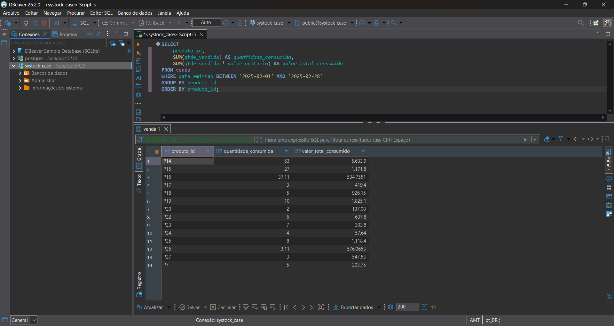
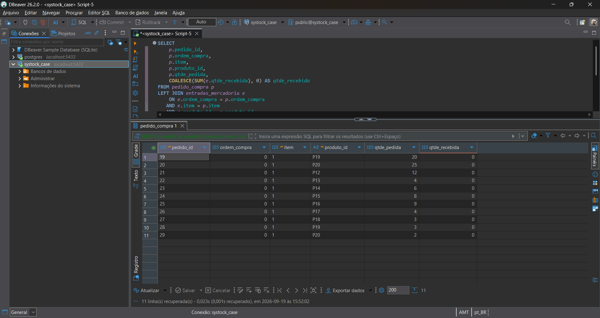
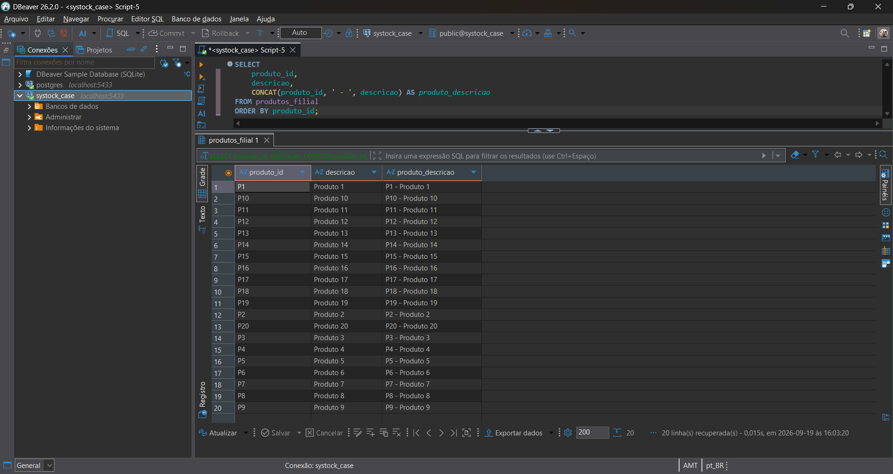
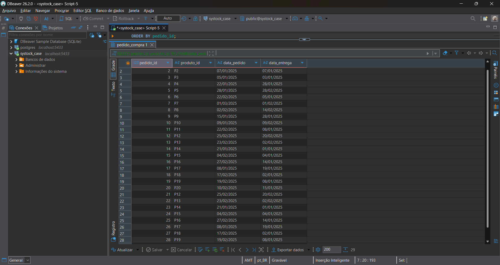
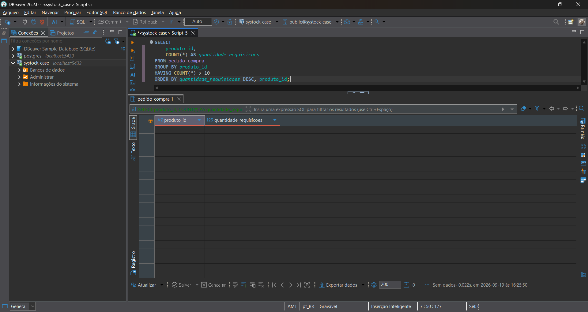
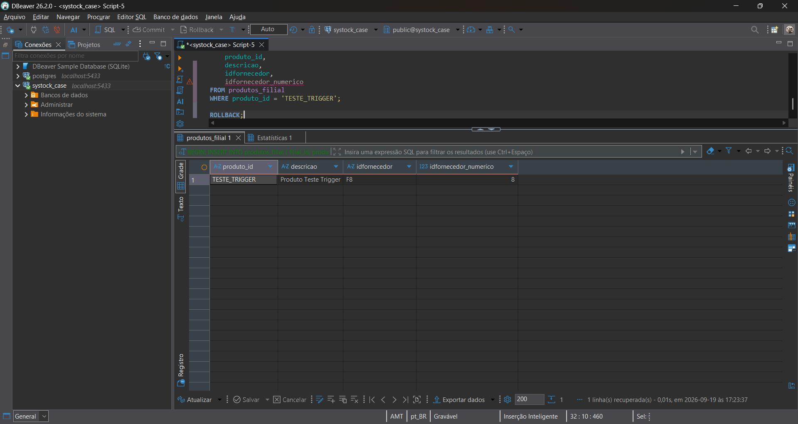
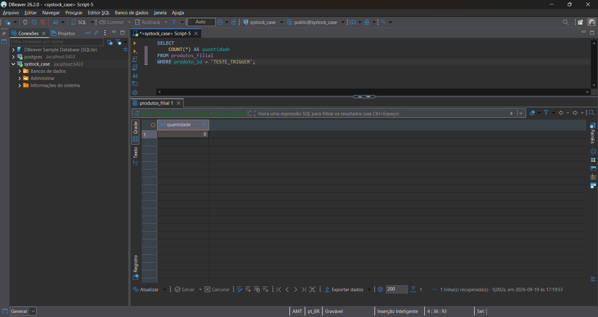

# 6. Resultados

## 6.1 Consultas SQL

Esta seção apresenta os resultados obtidos a partir das consultas SQL
executadas no banco PostgreSQL, conforme os requisitos definidos no case
técnico.

---

### 6.1.1 Consumo por produto em fevereiro de 2025

Foi realizada uma consulta sobre a tabela `venda`, considerando os
registros com `data_emissao` entre 01/02/2025 e 28/02/2025.

O resultado apresentou 14 produtos com movimentação no período.

Para cada produto foram consolidados:

- quantidade total consumida;
- valor total consumido.

O valor total consumido foi calculado a partir da multiplicação da
quantidade vendida pelo valor unitário de cada registro, seguida da
agregação por produto.

#### Resultado

| Produto | Quantidade consumida | Valor total consumido |
|---|---:|---:|
| P14 | 53 | 5.633,90 |
| P15 | 27 | 1.171,80 |
| P16 | 37,11 | 534,7551 |
| P17 | 3 | 419,40 |
| P18 | 5 | 926,15 |
| P19 | 10 | 1.825,10 |
| P20 | 2 | 137,08 |
| P22 | 6 | 637,80 |
| P23 | 7 | 303,80 |
| P24 | 4 | 57,64 |
| P25 | 8 | 1.118,40 |
| P26 | 3,11 | 576,0653 |
| P27 | 3 | 547,53 |
| P7 | 5 | 203,75 |

#### Evidência

---

### 6.1.2 Produtos solicitados, mas não recebidos

Foi realizada uma consulta relacionando os registros de `pedido_compra`
com `entradas_mercadoria`, utilizando `ordem_compra`, `item` e
`produto_id` para identificar os recebimentos correspondentes.

Foram identificados **11 registros de produtos solicitados sem
quantidade recebida registrada**.

Todos os registros encontrados possuem `ordem_compra = 0` e
`qtde_recebida = 0`, indicando ausência de uma ordem de compra válida
e de recebimento registrado na origem.

Os registros foram mantidos na base e sinalizados como inconsistência,
sem aplicação de correção automática.

#### Resultado

| Pedido | Ordem de compra | Item | Produto | Qtde. pedida | Qtde. recebida |
|---:|---:|---:|---|---:|---:|
| 19 | 0 | 1 | P19 | 20 | 0 |
| 20 | 0 | 1 | P20 | 25 | 0 |
| 21 | 0 | 1 | P12 | 12 | 0 |
| 22 | 0 | 1 | P13 | 4 | 0 |
| 23 | 0 | 1 | P14 | 6 | 0 |
| 24 | 0 | 1 | P15 | 8 | 0 |
| 25 | 0 | 1 | P16 | 9 | 0 |
| 26 | 0 | 1 | P17 | 4 | 0 |
| 27 | 0 | 1 | P18 | 3 | 0 |
| 28 | 0 | 1 | P19 | 3 | 0 |
| 29 | 0 | 1 | P20 | 2 | 0 |

#### Evidência

---

## 6.2 Transformações e regras solicitadas

### 6.2.1 Concatenação de produto e descrição

Foi realizada uma transformação para concatenar o identificador do produto
com sua respectiva descrição.

O formato utilizado foi:

`produto_id - descricao`

A consulta foi executada sobre a tabela `produtos_filial` e apresentou os
20 produtos cadastrados na base.

A consulta utilizada está disponível em:

`database/05-transformations.sql`

#### Evidência

---

### 6.2.2 Formatação das datas

As datas presentes na tabela `pedido_compra` foram formatadas para o padrão
solicitado no case:

`DD/MM/YYYY`

Foi utilizada a função `TO_CHAR` do PostgreSQL para apresentar as datas de
pedido e entrega no formato definido.

A consulta utilizada está disponível em:

`database/05-transformations.sql`

#### Evidência

---

### 6.2.3 Produtos requisitados mais de 10 vezes

Foi realizada a contagem das requisições por produto na tabela
`pedido_compra`.

A regra utilizada foi:

`COUNT(*) > 10`

A consulta não retornou registros.

Dessa forma, nenhum produto apresentou mais de 10 requisições no conjunto de
dados analisado.

A consulta utilizada está disponível em:

`database/05-transformations.sql`

#### Evidência

---

### 6.2.4 Identificação numérica dos fornecedores

Foi implementado o tratamento do identificador dos fornecedores para permitir
o relacionamento por meio de um identificador numérico.

Foi adicionada a coluna `idfornecedor_numerico` na tabela `fornecedor`, com o
mapeamento dos identificadores existentes.

O resultado obtido foi:

| Identificador | Identificador numérico |
|---|---:|
| F1 | 1 |
| F2 | 2 |
| F3 | 3 |
| F4 | 4 |
| F5 | 5 |
| F6 | 6 |
| F7 | 7 |
| F8 | 8 |
| F9 | 9 |
| F10 | 10 |
| F11 | 11 |
| F12 | 12 |
| F13 | 13 |
| F14 | 14 |
| F15 | 15 |
| F16 | 16 |
| F17 | 17 |
| F18 | 18 |
| F19 | 19 |
| F20 | 20 |

A implementação está disponível em:

`database/06-trigger.sql`

#### Evidência

---

### 6.2.5 Relacionamento entre produto e fornecedor

Foi adicionada a coluna `idfornecedor_numerico` à tabela
`produtos_filial`.

O relacionamento foi implementado por meio de uma chave estrangeira entre:

`produtos_filial.idfornecedor_numerico`

e

`fornecedor.idfornecedor_numerico`.

A validação apresentou os 20 produtos cadastrados relacionados aos seus
respectivos fornecedores.

#### Evidência

Também foi realizada uma validação específica da integridade do identificador
numérico, não sendo encontrados registros sem fornecedor correspondente.

#### Evidência

---

### 6.2.6 Trigger de preenchimento do identificador numérico

Foi implementada uma trigger para preencher automaticamente o campo
`idfornecedor_numerico` da tabela `produtos_filial` durante operações de
inserção ou atualização do fornecedor.

A trigger criada foi:

`trg_preencher_idfornecedor_numerico`

A função associada realiza a busca do fornecedor informado em
`idfornecedor` e preenche o identificador numérico correspondente.

Caso o fornecedor informado não seja encontrado no cadastro, a função
interrompe a operação e retorna uma exceção.

A implementação está disponível em:

`database/06-trigger.sql`

#### Teste funcional

Foi realizado um teste utilizando o fornecedor `F8`.

O registro temporário foi inserido com:

`idfornecedor = F8`

A trigger preencheu automaticamente:

`idfornecedor_numerico = 8`

Após a validação do comportamento, a transação foi revertida utilizando
`ROLLBACK`, evitando a permanência do registro de teste na base.

#### Evidências

---

## 6.3 Considerações finais

Os resultados foram obtidos diretamente a partir dos dados importados para o
PostgreSQL e validados por meio de consultas SQL executadas no DBeaver.

As transformações solicitadas no case foram implementadas e documentadas,
incluindo:

- consumo por produto em fevereiro de 2025;
- identificação de produtos solicitados e não recebidos;
- concatenação de produto e descrição;
- formatação das datas;
- identificação de produtos com mais de 10 requisições;
- tratamento do identificador numérico dos fornecedores;
- relacionamento entre produtos e fornecedores;
- implementação e teste da trigger.

As inconsistências identificadas durante a análise não foram corrigidas
automaticamente nesta etapa. O tratamento considera a preservação dos dados de
origem, a rastreabilidade das alterações e a necessidade de validação antes de
qualquer correção definitiva.

As consultas utilizadas estão disponíveis no diretório:

`database/`

As evidências correspondentes estão armazenadas no diretório:

`evidence/`